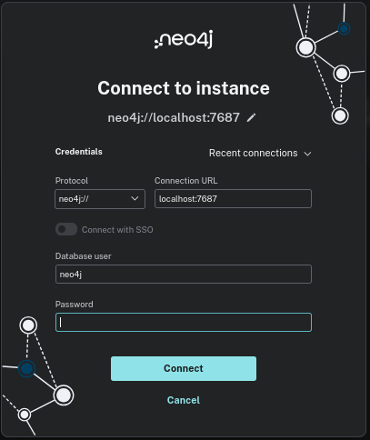
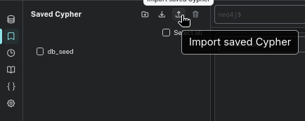
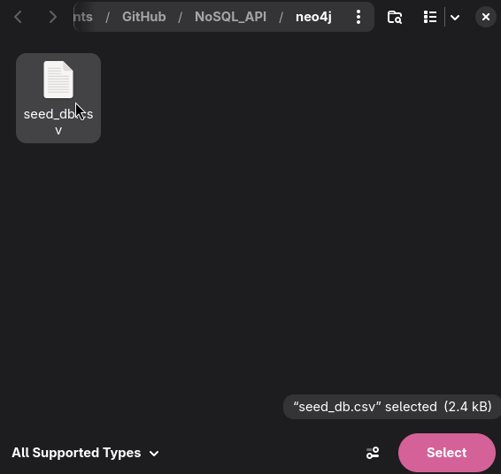
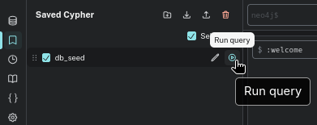
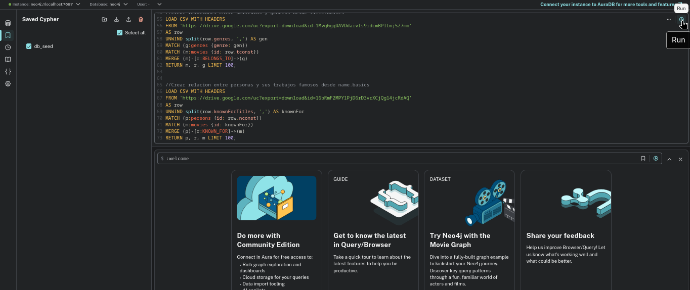

# Movie Graph API

API RESTful para un catálogo de películas respaldado por una base de datos de 
grafos. Desarrollada empleando **FastAPI + Python** para el curso CI-0141 Bases 
de Datos Avanzadas — UCR.

## Requisitos

- Python 3.11+
- pip

## Instalación de base de datos

Antes de configurar la API, se debe iniciar el contenedor de Docker de Neo4j de 
forma aislada:

Iniciar el Daemon de Docker:
```sh
sudo systemctl start docker
```

Iniciar el contenedor:
```bash
cd neo4j
docker compose up -d
cd ..
```

Esto levantará el motor de grafos en segundo plano:

* **Interfaz Web (Neo4j Browser):** http://localhost:7474 (para visualizar los nodos y aristas).
* **Puerto de Comunicación (Bolt):** `7687` (usado internamente por la API).


## Instalación de backend para administrar la Base de datos

```bash
# 1. Clonar el repositorio
git clone <url-del-repo>
cd NoSQL_API
```

* ### Windows 10/11

```bash
# 2. Crear y activar un entorno virtual
python -m venv venv
venv\Scripts\activate

# 3. Instalar las dependencias
pip install -r requirements.txt

# 4. Copiar el archivo de configuración
cp .env.example .env
```

* ### Linux (Debian & Ubuntu) / macOS 

```bash
# 2. Crear y activar un entorno virtual
python3 -m venv venv
source venv/bin/activate

# 3. Instalar dependencias
pip install -r requirements.txt

# 4. Copiar el archivo de configuración
cp .env.example .env
```

## Configuración de la base de datos

Se debe abrir el archivo `.env` recién creado y asegurarse de que tenga las 
siguientes variables asignadas para activar Neo4j:

```env
DB_BACKEND=neo4j
NEO4J_URI=bolt://localhost:7687
```

## Ejecutar el servidor

```bash
uvicorn app.main:app --reload
```

- La API quedará disponible en `http://localhost:8000`.
- Swagger UI: `http://localhost:8000/docs`

## Endpoints

| Método | Ruta | Descripción |
|--------|------|-------------|
| GET    | `/`  | Health check |
| POST   | `/api/movies` | Crear una película |
| GET    | `/api/movies` | Listar todas (paginado: `?page=1&limit=10`) |
| GET    | `/api/movies/search` | Buscar con filtros |
| GET    | `/api/movies/{id}` | Obtener una por ID |
| PUT    | `/api/movies/{id}` | Actualizar una película |
| DELETE | `/api/movies/{id}` | Eliminar una película |
| GET    | `/api/movies/{id}/similar` | Películas similares (traversal de grafo) |

* ### Parámetros de búsqueda (`/api/movies/search`)

| Parámetro | Tipo | Descripción |
|-----------|------|-------------|
| `title` | string | Búsqueda parcial por título |
| `genre` | string | Filtro por género (ej: `Action`, `Drama`) |
| `year_min` | int | Año mínimo de estreno |
| `year_max` | int | Año máximo de estreno |
| `rating_min` | float | Rating mínimo IMDb (0.0 – 10.0) |
| `actor_name` | string | Nombre de actor (solo con BD de grafos real) |


## Carga de datos (seed)

Para cargar los datos es necesario una conexion a internet para recibir los datos
y acceder a la interfaz web de neo4j (por defecto http://localhost:7474).

Una vez ingresado a Neo4j en un browser, este mostrara un modal solicitando la 
información para conectarse a la instancia.



Tras haber seguido los pasos en este documento, la conexión no requerirá de una 
contraseña, y le permitirá conectarse con la información por defecto. Tras 
conectarse a la  instancia, se tienen 2 opciones para inicializar la base de datos:

* ### 1. Importar seed_db.csv
Dar click a la sección "saved cypher" y seleccionar "Import saved cypher"


Se mostrará el explorador de archivos, navegue hasta la carpeta neo4j de este 
proyecto y seleccione el archivo [seed_db.csv](./neo4j/seed_db.csv).



Al hacer esto se importaran las instrucciones y se mostrara en la lista el documento.

Dirija el raton sobre la entrada de la lista y a la derecha se mostrara un círculo
azul similar a un boton de reproducir, de click ahí para ejecutarlo y cargar la 
base de datos.


* ### 2. Copiar un query

Alternativamente, se puede dirigir a la misma carpeta neo4j de este proyecto y 
abrir el archivo [seed_db.cypher](./neo4j/seed_db.cypher) con cualquier editor
de texto, copie todos sus contenidos, y péguelos en la barra superior derecha de
Neo4j browser.

Con el texto en la barra, en la esquina superior derecha del espacio donde pegó
el texto, se podrá ver un círculo azul similar a un botón de reproducir. De click
ahí para ejecutarlo y cargar la base de datos.



## Estructura del proyecto

```
NoSQL_API/
├── app/
│   ├── main.py              # FastAPI app
│   ├── config.py            # Variables de entorno
│   ├── dependencies.py      # Inyección de dependencias
│   ├── models/movie.py      # Esquemas Pydantic
│   ├── repositories/
│   │   ├── base.py          # Interfaz abstracta
│   │   ├── mock.py          # Implementación en memoria
│   │   └── neo4j.py         # Implementación de Neo4j con Cypher
│   └── routers/movies.py    # Endpoints
├── scripts/seed_db.py       # Carga de datos IMDb + MovieLens
├── requirements.txt
└── .env.example
```
